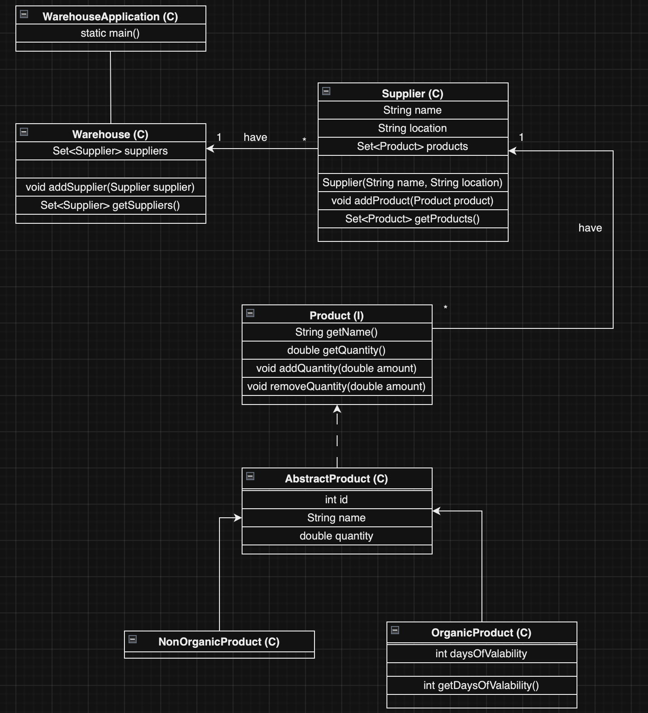

# Warehouse-Stock-Management
## Advanced Java Programming
## UNSTPB - Faculty of Automatic Control and Computer Science
### Barbu Angelo-Gabriel - Advanced Software Services Master's Degree

University project for Advanced Java Programming course that simulates the business logic of a warehouse stock management app. The project implements functionalities presented in the course, such as:
- collections for object sets and warehouse report
- multi-threading
- lambdas for listener function implementation
- streams for streams warehouse report

The UML Class diagram is the following:

The unit testing is done using JUnit 4.13. Unit tests were writted for:
- Classes
- WarehouseReport (Collections)
- WarehouseReportStreams (Streams)
Unit tests are covering 73% of the code.

